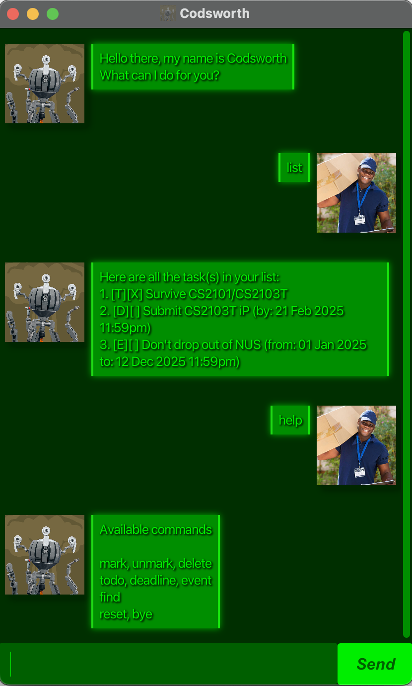

# Codsworth User Guide



Need a handy companion to assist you after the end of all human life? 
Codsworth is here for you!

Codsworth is a desktop app for managing tasks, 
optimized for use via a Command Line Interface (CLI) while still having 
the benefits of a Graphical User Interface (GUI). 
If you can type fast, Codsworth can get your tasks done faster than traditional GUI apps.

## Adding to do tasks

Add to do task that doesn't have any deadline or time requirements.

Format: ```todo [TASK NAME]```

Example: `todo CS2103T iP`

Codsworth will return a task of that name

```
Got it, I've added this task:
[T][ ] CS2103T iP
You have 1 task(s) left.
```

## Adding deadlines

Add a deadline task which has a deadline requirement.

Format: ```deadline [TASK NAME] /by [DD-MM-YYYY] [HHMM]```
> [!TIP]
> Timing is optional, you don't have to provide HHMM

Example: `deadline CS2103T iP /by 21-02-2025 2359`

Codsworth will return a deadline of that name

```
Got it, I've added this task:
[D][ ] CS2103T iP (by: 21 Feb 2025 11:59pm)
You have 1 task(s) left.
```

## Adding events

Add an event task which has start and end time requirement.

Format: ```event [TASK NAME] /from [DD-MM-YYYY] [HHMM] /to [DD-MM-YYYY] [HHMM]```
> [!TIP]
> Timing is optional, you don't have to provide HHMM

Example: `event CS2103T lecture /from 21-02-2025 1600 /to 21-02-2025 1800`

Codsworth will return an event of that name

```
Got it, I've added this task:
[E][ ] CS2103T lecture (from: 21 Feb 2025 4pm to: 21 Feb 2025 6pm)
You have 1 task(s) left.
```

## Listing all tasks

Shows a list of all tasks.

Example: `list`

```
Here are all the task(s) in your list:
1. [T][ ] Survive CS2101/CS2103T
```

## Mark as completed

Marks a specified task as completed

Format: `mark (index)`

Example: `mark 1`


```
Nice, I've marked this task as completed!
1. [T][X] Survive CS2101/CS2103T
You have 1 task(s) left.
```

## Unmark completed task

Unmarks a specified task as uncompleted

Format: `mark (index)`

Example: `mark 1`


```
I've unmarked this task as completed!
1. [T][ ] Survive CS2101/CS2103T
You have 1 task(s) left.
```

## Delete a task

Deletes a specified task

Format: `delete (index)`

Example: `mark 1`


```
The task has been deleted.
```

## Help

Lists all the commands available

Example: `help`

```
Available Commands

mark, unmark, delete
todo, deadline, event
find
reset, bye
```

## Finding task

Finds task whose name contain the given keyword

Format: `find (KEYWORD)`

Example: `find CS2101`

```
Here are the matching task(s):
1. [T][ ] Survive CS2101/CS2103T
```


## Reset

Clears all saved tasks and storage

Example: `reset`

```
Everything has been cleared
```
